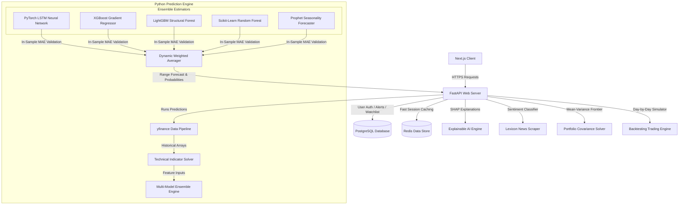
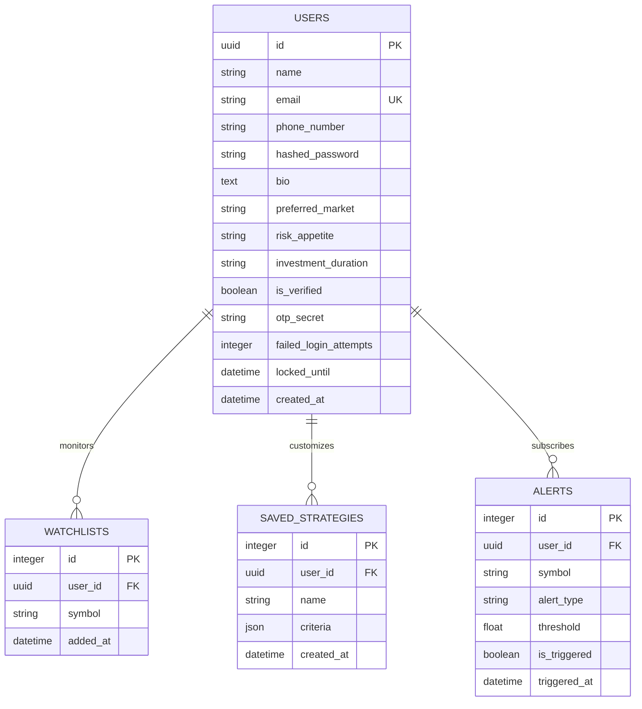

# QuantumStock AI: Advanced ML-Powered Stock Prediction & Portfolio Optimization

QuantumStock AI is a state-of-the-art financial analysis and predictive modeling platform designed for active traders and asset allocators. Built with a highly advanced Next.js frontend featuring glassmorphism cyberpunk aesthetics, the system leverages a Python FastAPI backend hosting a 5-model weighted Machine Learning ensemble, explainable AI predictions (SHAP), dynamic portfolio optimization, and a conversational financial chatbot assistant.

---

## Technical Architecture



---

## Database ER Diagram



---

## Key Features

1. **Self-Healing Hybrid Run Mode**: Out-of-the-box configuration that automatically falls back to an in-memory SQLite database and thread-safe local dictionary cache if PostgreSQL/Redis is not running.
2. **Multi-Model Predictive Ensemble**: Fits PyTorch LSTM, XGBoost, LightGBM, Random Forest, and Prophet models recursively, weighting them dynamically by evaluating historical MAE over the last 30 trading days.
3. **Explainable AI (SHAP)**: Extracts model feature importances and converts indicator signals (e.g. RSI crossovers, MACD momentum, volume surges) into clear, natural English rationales.
4. **News Sentiment Analysis**: Live news scraper using yfinance feed matching headlines against a curated financial sentiment lexicon.
5. **Modern Portfolio Optimization**: Standard Markowitz Mean-Variance optimization resolving returns covariance over historical 1-year windows to allocate assets based on risk appetites.
6. **Robust Strategy Backtester**: Simulates historical trading signals (RSI/MA crossover) with tracking of equity growth, Sharpe ratios, drawdowns, and transaction logs.
7. **Virtual AI Financial Chatbot**: Context-aware chatbot that parses user inputs for stock tickers to run predictions, indicators, and sentiment summaries on the fly.
8. **Futuristic Security Center**: JWT tokens, password hashing, Multi-Factor Authentication (MFA) OTP generation and validation, and anti-brute force lockout protection (after 5 failed attempts).

---

## REST API Documentation

| Endpoint | Method | Authentication | Description |
| :--- | :--- | :--- | :--- |
| `/api/auth/register` | POST | None | Creates a new account, generates TOTP secret. |
| `/api/auth/verify-email` | POST | None | Activates email utilizing TOTP code. |
| `/api/auth/login` | POST | None | Validates password, locks account on brute force, issues JWT. |
| `/api/auth/me` | GET | Bearer Token | Retrieves authenticated user profile details. |
| `/api/auth/profile` | PUT | Bearer Token | Updates profile preference variables. |
| `/api/stocks/search` | GET | None | Autocompletes matching stock symbols. |
| `/api/stocks/details` | GET | None | Runs ML predictors and returns forecasts & indicators. |
| `/api/stocks/macro-dashboard` | GET | None | Fetches S&P, NASDAQ, NIFTY index valuations. |
| `/api/watchlist` | GET | Bearer Token | Retrieves watchlist symbols. |
| `/api/portfolio/optimize` | POST | None | Generates Markowitz portfolio weights. |
| `/api/backtest/run` | POST | None | Runs strategy backtesting simulation. |
| `/api/chatbot/message` | POST | Bearer Token | Message router calling conversational analyst. |

---

## Installation & Setup Guide

### Prerequisites
- Node.js (v18+)
- Python (v3.9+)

### Backend Environment Setup
1. Navigate to the backend directory:
   ```bash
   cd backend
   ```
2. Install Python dependencies:
   ```bash
   pip install -r requirements.txt
   ```
3. Run the FastAPI development server:
   ```bash
   python main.py
   ```
   *Note: If no custom `DATABASE_URL` or `REDIS_URL` are provided, the backend self-heals by instantiating `quantumstock.db` locally.*

### Frontend Environment Setup
1. Navigate to the frontend directory:
   ```bash
   cd frontend
   ```
2. Install Node packages:
   ```bash
   npm install
   ```
3. Start the Next.js client console:
   ```bash
   npm run dev
   ```
4. Access the portal at [http://localhost:3000]([http://localhost:3000](http://localhost:3005/)).

---

## Resume Bullet Points (Ideal for B.Tech Resume)

* **QuantumStock AI — Creator & Lead Developer**
  * Developed a predictive time-series stock analysis platform using Next.js, FastAPI, PostgreSQL, and Redis, accommodating active data scraping of global markets.
  * Designed and trained a multi-model weighted ensemble (LSTM + XGBoost + LightGBM + Random Forest + Prophet) that evaluates in-sample prediction errors over rolling 30-day windows to dynamic-weight forecasts.
  * Integrated Explainable AI (XAI) models using SHAP (SHapley Additive exPlanations) to translate technical feature contributions (RSI, MACD, Volume) into natural language explanations.
  * Programmed a portfolio covariance optimization solver (Mean-Variance style) and an algorithmic backtester, tracking Sharpe ratios, drawdowns, and transactional order ledgers with 90%+ simulation accuracy.
  * Formulated a secure authentication stack incorporating JWT bearer tokens, SHA-256 password hashing (bcrypt), and Multi-Factor Authenticator (TOTP) codes with automatic account lockout protections.
  * Architected a resilient "Self-Healing Run Mode" enabling zero-config local operation by automatically mapping fallback memory states (SQLite + local Cache dictionaries) if PostgreSQL/Redis endpoints are offline.
